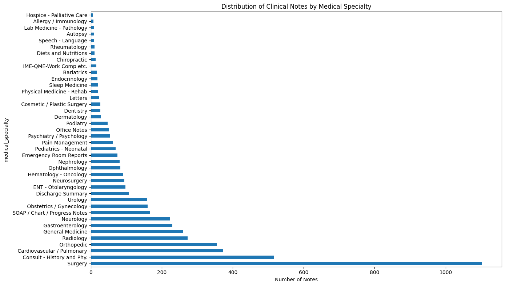
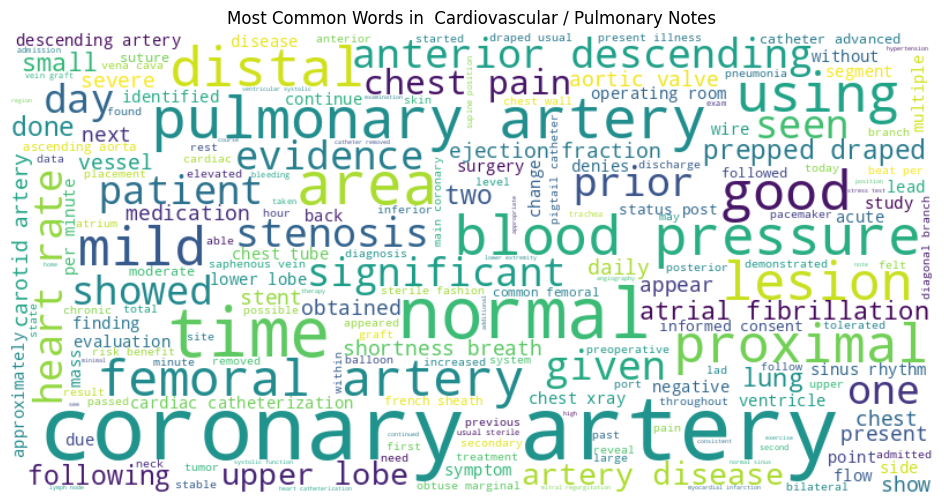
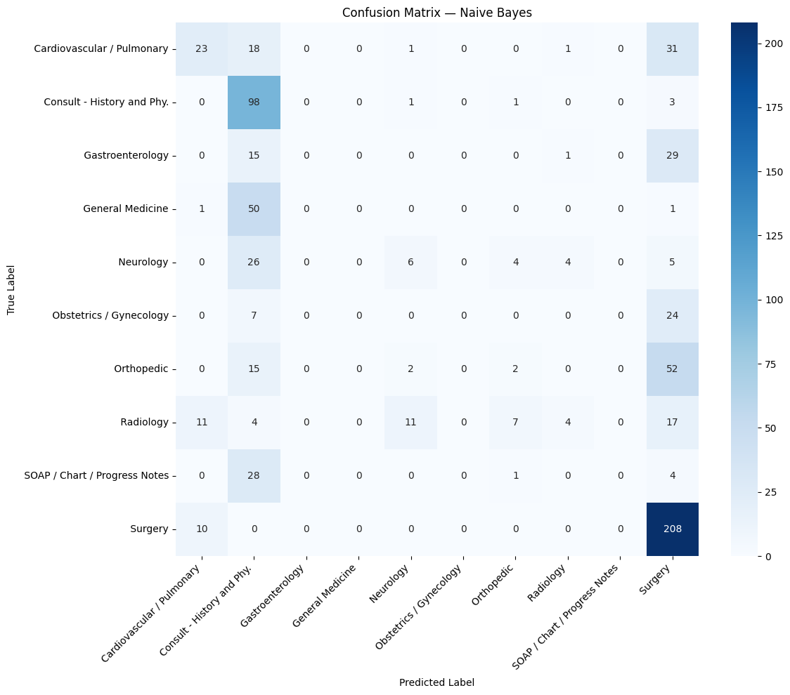
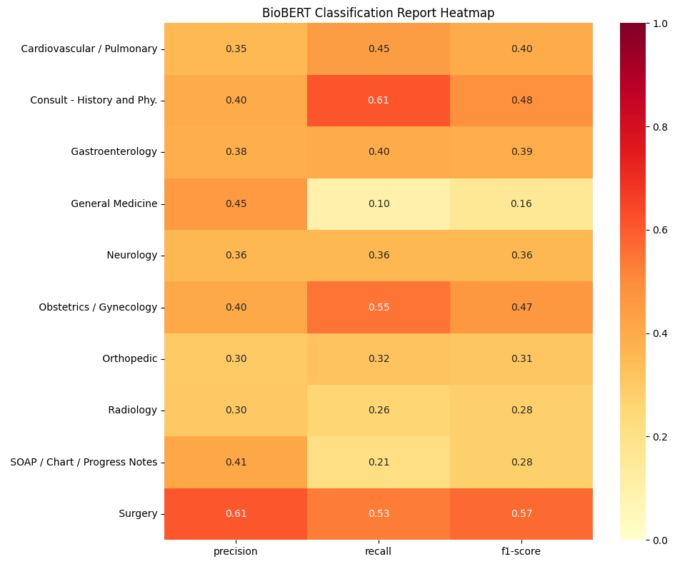

# 🏥 Clinical Notes Text Classifier

Automatically classifying anonymised clinical transcription notes into medical specialties using Natural Language Processing — from a TF-IDF baseline all the way to fine-tuning a domain-specific biomedical language model (BioBERT).

---

## Why This Problem Matters

Hospitals and healthcare systems generate thousands of unstructured clinical documents every day. Manually routing, coding, or categorising these notes is time-consuming and error-prone. An automated classifier can help streamline clinical documentation workflows, support medical coding, and improve the efficiency of health information management — a genuine priority for NHS trusts and health-tech organisations.

---

## Dataset

**Source:** [MTSamples — Medical Transcription Sample Reports](https://www.kaggle.com/datasets/tboyle10/medicaltranscriptions)

- **Size:** 4,999 real anonymised clinical transcription notes
- **Specialties:** 40 medical specialties
- **Filtered to:** Top 10 specialties by note count (3,628 notes total)
- **Target:** Multi-class classification — predict the medical specialty from the note text

**Top 10 specialties used:**

| Specialty | Notes |
|---|---|
| Surgery | 1,088 |
| Consult - History and Phy. | 516 |
| Cardiovascular / Pulmonary | 372 |
| Orthopedic | 355 |
| Radiology | 273 |
| General Medicine | 259 |
| Gastroenterology | 230 |
| Neurology | 223 |
| SOAP / Chart / Progress Notes | 166 |
| Obstetrics / Gynecology | 155 |

---

## Methodology

### 1. Exploratory Data Analysis
- Examined the distribution of notes across all 40 specialties, revealing a heavily imbalanced dataset dominated by Surgery notes
- Identified missing transcription text and removed affected rows
- Visualised the most common clinical terms per specialty using word clouds

### 2. Text Preprocessing
- Converted text to lowercase and removed numbers and special characters
- Removed standard English stopwords plus domain-specific medical stopwords that appear across all specialties (e.g. "patient", "procedure", "diagnosis") and carry little discriminative signal
- Applied lemmatisation to reduce words to their root forms (e.g. "bleeding", "bled" → "bleed")

### 3. Baseline Models — TF-IDF + Classical ML
Built a TF-IDF vectorisation pipeline and evaluated three classical classifiers:

- **Logistic Regression** — weighted by class to handle imbalance
- **Naive Bayes** — probabilistic baseline well-suited to text classification
- **Linear SVM** — margin-based classifier effective in high-dimensional text spaces

### 4. Advanced Model — BioBERT Fine-tuning
Fine-tuned **BioBERT** (`dmis-lab/biobert-base-cased-v1.2`), a transformer model pre-trained on PubMed abstracts and clinical notes from PubMed Central. Unlike TF-IDF which treats words independently, BioBERT understands the contextual meaning of medical language.

- Tokenised notes with a max length of 256 tokens
- Fine-tuned for 3 epochs with a batch size of 8
- Trained on Google Colab T4 GPU

---

## Results

| Model | Accuracy |
|---|---|
| Linear SVM | 0.2810 |
| Logistic Regression | 0.3912 |
| BioBERT | 0.4298 |
| **Naive Bayes** | **0.4697** |

**Best model: Naive Bayes** with an accuracy of 0.4697

### Confusion Matrix — Naive Bayes

### BioBERT Classification Report Heatmap

---

## Key Findings

- **Naive Bayes outperformed BioBERT** — an important and counterintuitive finding. On small, imbalanced datasets like MTSamples, simple probabilistic models can outperform complex transformers that require significantly more data to fine-tune effectively.
- **Surgery notes were the most accurately classified** across all models — likely because surgical transcriptions use highly specific procedural vocabulary that distinguishes them clearly from other specialties.
- **General Medicine was the hardest specialty to classify** — with a BioBERT F1-score of just 0.16, reflecting the inherently broad and overlapping nature of general medical notes.
- **Significant class imbalance drove model bias** — with Surgery accounting for ~30% of the filtered dataset, models showed a tendency to over-predict Surgery, pulling accuracy away from minority specialties like Obstetrics/Gynecology and SOAP Notes.
- **Specialty overlap is a fundamental challenge** — clinical notes for Cardiovascular and Radiology specialties frequently contain similar terminology, making them difficult to distinguish even for a domain-aware model like BioBERT.

---

## Why BioBERT Underperformed the Baseline

This is worth explaining openly, as it reflects real-world NLP challenges:

1. **Dataset size** — BioBERT and transformer models generally require thousands of labelled examples per class to fine-tune effectively. With some specialties having fewer than 200 samples, the model lacked sufficient signal.
2. **Limited training** — only 3 epochs of fine-tuning; more epochs with learning rate scheduling could improve performance.
3. **Truncation** — setting max token length to 256 may have cut off clinically relevant content in longer notes.
4. **Class imbalance** — no oversampling or class weighting was applied during BioBERT fine-tuning, unlike the classical models.

These are areas for future improvement rather than flaws in the approach — identifying them demonstrates applied research thinking.

---

## Limitations

- **Dataset size:** MTSamples is small for deep learning. Real-world clinical NLP systems train on millions of EHR documents.
- **Data availability:** Richer, more recent clinical text data is not publicly accessible due to HIPAA and GDPR patient privacy regulations, making MTSamples the standard public benchmark for clinical NLP.
- **Specialty ambiguity:** Several specialties share overlapping vocabulary, making perfect separation impossible without additional metadata (e.g. ICD codes, department labels).
- **BioBERT fine-tuning constraints:** Limited Colab GPU compute restricted training depth and hyperparameter search.

## How to Run

1. Open `notebooks/clinical_notes_classifier.ipynb` in [Google Colab](https://colab.research.google.com/)
2. Enable GPU: **Runtime → Change runtime type → T4 GPU**
3. Upload `mtsamples.csv` to the Colab session
4. Run all cells in order

**Dependencies:**

- pandas
- numpy
- matplotlib
- seaborn
- scikit-learn
- nltk
- wordcloud
- transformers
- torch
- datasets

---

## Future Improvements

- Apply SMOTE or class weighting during BioBERT fine-tuning to address class imbalance
- Extend fine-tuning to 10+ epochs with learning rate scheduling
- Experiment with longer token lengths (512) to capture more note context
- Try ClinicalBERT — fine-tuned specifically on MIMIC-III clinical notes
- Expand to all 40 specialties with a larger dataset
- Add SHAP-based explainability to identify which clinical terms drive specialty predictions

---

## Tools & Libraries

